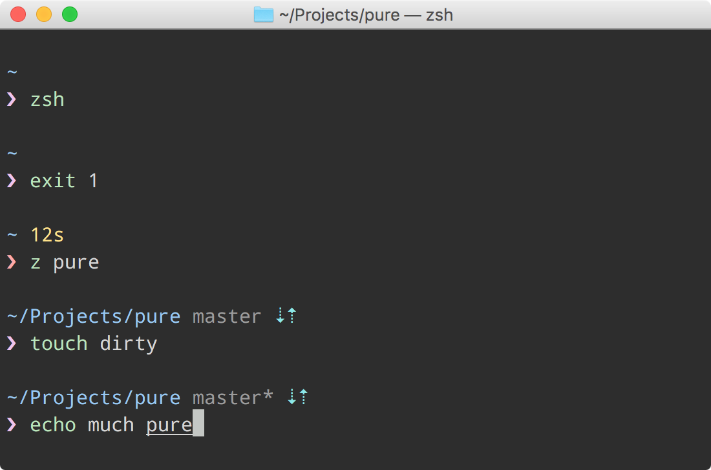

# Pure

> Pretty, minimal and fast ZSH prompt




## Overview

Most prompts are cluttered, ugly and slow. I wanted something visually pleasing that stayed out of my way.

### Why?

- Comes with the perfect prompt character.
  Author went through the whole Unicode range to find it.
- Shows `git` branch and whether it's dirty (with a `*`).
- Indicates when you have unpushed/unpulled `git` commits with up/down arrows. *(Check is done asynchronously!)*
- Prompt character turns red if the last command didn't exit with `0`.
- Command execution time will be displayed if it exceeds the set threshold.
- Username and host only displayed when in an SSH session.
- Shows the current path in the title and the [current folder & command](screenshot-title-cmd.png) when a process is running.
- Makes an excellent starting point for your own custom prompt.


## Install

Can be installed with `npm` or manually. Requires Git 2.0.0+ and ZSH 5.2+. Older versions of ZSH are known to work, but they are **not** recommended.

### npm

```console
$ npm install --global pure-prompt
```

That's it. Skip to [Getting started](#getting-started).

### Manually

1. Either…
  - Clone this repo
  - add it as a submodule, or
  - just download `pure.zsh` and `async.zsh`

2. Symlink `pure.zsh` to somewhere in [`$fpath`](http://www.refining-linux.org/archives/46/ZSH-Gem-12-Autoloading-functions/) with the name `prompt_pure_setup`.

3. Symlink `async.zsh` in `$fpath` with the name `async`.

#### Example

```console
$ ln -s "$PWD/pure.zsh" /usr/local/share/zsh/site-functions/prompt_pure_setup
$ ln -s "$PWD/async.zsh" /usr/local/share/zsh/site-functions/async
```
*Run `echo $fpath` to see possible locations.*

For a user-specific installation (which would not require escalated privileges), simply add a directory to `$fpath` for that user:

```sh
# .zshenv or .zshrc
fpath=( "$HOME/.zfunctions" $fpath )
```

Then install the theme there:

```console
$ ln -s "$PWD/pure.zsh" "$HOME/.zfunctions/prompt_pure_setup"
$ ln -s "$PWD/async.zsh" "$HOME/.zfunctions/async"
```


## Getting started

Initialize the prompt system (if not so already) and choose `pure`:

```sh
# .zshrc
autoload -U promptinit; promptinit
prompt pure
```


## Options

### `PURE_CMD_MAX_EXEC_TIME`

The max execution time of a process before its run time is shown when it exits. Defaults to `5` seconds.

### `PURE_GIT_PULL`

Set `PURE_GIT_PULL=0` to prevent Pure from checking whether the current Git remote has been updated.

### `PURE_GIT_UNTRACKED_DIRTY`

Set `PURE_GIT_UNTRACKED_DIRTY=0` to not include untracked files in dirtiness check. Only really useful on extremely huge repos like the WebKit repo.

### `PURE_GIT_DELAY_DIRTY_CHECK`

Time in seconds to delay git dirty checking for large repositories (git status takes > 2 seconds). The check is performed asynchronously, this is to save CPU. Defaults to `1800` seconds.

### `PURE_PROMPT_SYMBOL`

Defines the prompt symbol. The default value is `❯`.

### `PURE_GIT_DOWN_ARROW`

Defines the git down arrow symbol. The default value is `⇣`.

### `PURE_GIT_UP_ARROW`

Defines the git up arrow symbol. The default value is `⇡`.

## Example

```sh
# .zshrc

autoload -U promptinit; promptinit

# optionally define some options
PURE_CMD_MAX_EXEC_TIME=10

prompt pure
```


## Tips

In the screenshot you see Pure running in [Hyper](https://hyper.is) with the [hyper-snazzy](https://github.com/sindresorhus/hyper-snazzy) theme and Menlo font.

The [Tomorrow Night Eighties](https://github.com/chriskempson/tomorrow-theme) theme with the [Droid Sans Mono](https://fonts.google.com/specimen/Droid+Sans+Mono) font (15pt) is also a [nice combination](https://github.com/sindresorhus/pure/blob/95ee3e7618c6e2162a1e3cdac2a88a20ac3beb27/screenshot.png).<br>
*Just make sure you have anti-aliasing enabled in your terminal.*

To have commands colorized as seen in the screenshot, install [zsh-syntax-highlighting](https://github.com/zsh-users/zsh-syntax-highlighting).


## Integration

### [oh-my-zsh](https://github.com/robbyrussell/oh-my-zsh)

1. Symlink (or copy) `pure.zsh` to `~/.oh-my-zsh/custom/pure.zsh-theme`.
2. Symlink (or copy) `async.zsh` to `~/.oh-my-zsh/custom/async.zsh`.
3. Set `ZSH_THEME="pure"` in your `.zshrc` file.

Or skip the `oh-my-zsh` integration above and simply:

1. Set `ZSH_THEME=""` in your `.zshrc` to disable oh-my-zsh themes.
2. Follow the Pure [Install](#install) instructions.

### [prezto](https://github.com/sorin-ionescu/prezto)

Pure is bundled with Prezto. No need to install it.

Set `zstyle ':prezto:module:prompt' theme 'pure'` in `~/.zpreztorc`.

### [zim](https://github.com/Eriner/zim)

Pure is bundled with Zim. No need to install it.

Set `zprompt_theme='pure'` in `~/.zimrc`.

### [antigen](https://github.com/zsh-users/antigen)

Update your `.zshrc` file with the following two lines (order matters). Do not use the `antigen theme` function.

```sh
antigen bundle mafredri/zsh-async
antigen bundle sindresorhus/pure
```

### [antibody](https://github.com/getantibody/antibody)

Update your `.zshrc` file with the following two lines (order matters):

```sh
antibody bundle mafredri/zsh-async
antibody bundle sindresorhus/pure
```

### [zplug](https://github.com/zplug/zplug)

Update your `.zshrc` file with the following two lines (order matters):

```sh
zplug mafredri/zsh-async, from:github, defer:0  # Load this first
zplug sindresorhus/pure, use:pure.zsh, from:github, as:theme
```

## FAQ

### My preprompt is missing when I clear the screen with Ctrl+L

Pure doesn't register its custom *clear-screen* widget if it has been previously modified. If you haven't registered your own zle widget with `zle -N clear-screen custom-clear-screen` it might have been done by third-party modules. For example `zsh-syntax-highlighting` and `zsh-history-substring-search` are known to do this and they should for that reason be **the very last thing** in your `.zshrc` (as pointed out in their documentation).

To find out the culprit that is overriding your *clear-screen* widget, you can run the following command: `zle -l | grep clear-screen`.

### I am stuck in a shell loop in my terminal that ask me to authenticate. What should I do ?

[This is a known issue](https://github.com/sindresorhus/pure/issues/76).
Using `git pull` when you get the username prompt should help you to break the loop by giving you a real prompt for this. **[This has been fixed in git 2.3](https://github.com/sindresorhus/pure/commit/f43ab97e1cf4a276b7a6e33eac055ee16610be15)**

### I am seeing the error `zpty: can't open pseudo terminal: bad file descriptor`.

[This is a known issue](https://github.com/sindresorhus/pure/issues/117). `zsh/zpty` requires either legacy bsd ptys or access to `/dev/ptmx`. Here are some known solutions.

#### Gentoo

```console
$ sudo sh -c "echo 'SANDBOX_WRITE=\"/dev/ptmx\"' > /etc/sandbox.d/10zsh"
$ sudo emerge -1 zsh
```

#### FreeBSD 10.1

On a default setup, running the command `kldload pty` should do the trick. If you have a custom kernel, you might need to add `device pty` to the configuration file ([example](https://github.com/nbari/freebsd/blob/58646a9c3c4aaabf6f6467ff505f27f09e29dc75/kernels/xen.kernel#L188)).

## Ports

* **Bash**
	* [sapegin/dotfiles](https://github.com/sapegin/dotfiles)’s [prompt](https://github.com/sapegin/dotfiles/blob/dd063f9c30de7d2234e8accdb5272a5cc0a3388b/includes/bash_prompt.bash) and [color theme](https://github.com/sapegin/dotfiles/tree/master/color) for `Terminal.app`.
* **Fish**
	* [brandonweiss/pure.fish](https://github.com/brandonweiss/pure.fish): a Pure-inspired prompt for Fish, not intended to have feature parity.
	* [rafaelrinaldi/pure](https://github.com/rafaelrinaldi/pure), support for bare Fish and various framework ([Oh-My-Fish](https://github.com//oh-my-fish/oh-my-fish), [Fisherman](https://github.com//fisherman/fisherman) and [Wahoo](https://github.com//bucaran/wahoo)).
* **Zsh**
  * [therealklanni/purity](https://github.com/therealklanni/purity): a more compact current working directory, important details on the main prompt line, and extra Git indicators.
  * [intelfx/pure](https://github.com/intelfx/pure): Solarized-friendly colors, highly verbose and fully async Git integration

## Team

[](http://sindresorhus.com) | [](https://github.com/mafredri)
---|---
[Sindre Sorhus](http://sindresorhus.com) | [Mathias Fredriksson](https://github.com/mafredri)


## License

MIT © [Sindre Sorhus](http://sindresorhus.com)
